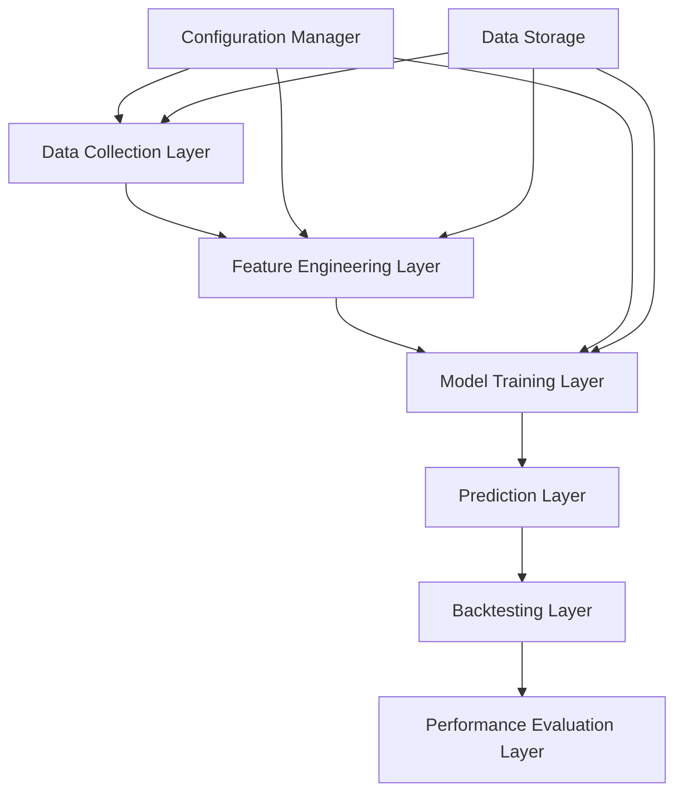

# Design Document

## Overview

The Stock Direction Predictor is a comprehensive machine learning system designed to predict directional movement of stock prices using multiple candlestick pattern strategies and advanced technical indicators. The system implements a comparative analysis framework that evaluates different pattern lengths (3, 5, 7, and 14 days) across multiple ML algorithms to identify optimal configurations for stock direction prediction.

The system follows a modular architecture with clear separation between data collection, feature engineering, model training, and backtesting components. It leverages Yahoo Finance for data acquisition, pandas_ta for technical indicator calculations, and multiple ML frameworks including XGBoost for baseline comparisons.

## Architecture

The system follows a layered architecture pattern with the following main components:



### Layer Responsibilities

- **Data Collection Layer**: Retrieves historical stock data from Yahoo Finance API
- **Feature Engineering Layer**: Generates technical indicators and candlestick pattern signals
- **Model Training Layer**: Trains multiple ML models with different pattern configurations
- **Prediction Layer**: Generates trading signals using trained models
- **Backtesting Layer**: Simulates trading strategies on historical data
- **Performance Evaluation Layer**: Calculates comprehensive performance metrics

## Components and Interfaces

### 1. Data Collection Service

**Interface**: `IDataCollectionService`
```python
class IDataCollectionService:
    def fetch_stock_data(self, symbols: List[str], start_date: str, end_date: str) -> Dict[str, pd.DataFrame]
    def validate_data_completeness(self, data: pd.DataFrame) -> bool
    def handle_missing_values(self, data: pd.DataFrame) -> pd.DataFrame
```

**Implementation**: `YahooFinanceDataService`
- Retrieves OHLC data and volume for specified stock symbols
- Implements retry mechanisms with exponential backoff
- Validates data integrity and handles missing values

### 2. Feature Engineering Module

**Interface**: `IFeatureEngineeringModule`
```python
class IFeatureEngineeringModule:
    def calculate_technical_indicators(self, data: pd.DataFrame) -> pd.DataFrame
    def generate_candlestick_signals(self, data: pd.DataFrame, pattern_length: int) -> pd.DataFrame
    def detect_chart_patterns(self, data: pd.DataFrame) -> pd.DataFrame
    def calculate_fibonacci_levels(self, data: pd.DataFrame) -> pd.DataFrame
```

**Technical Indicators**:
- RSI (Relative Strength Index)
- MACD (Moving Average Convergence Divergence)
- EMA20, EMA50, EMA200 (Exponential Moving Averages)
- ATR (Average True Range)
- SMA (Simple Moving Average)

**Pattern Detection**:
- Golden Cross signals (EMA crossovers)
- Head and Shoulder patterns
- Wedge formations
- Fibonacci retracement levels

### 3. Candlestick Pattern Generator

**Interface**: `ICandlestickPatternGenerator`
```python
class ICandlestickPatternGenerator:
    def generate_n_day_signals(self, data: pd.DataFrame, n: int) -> pd.Series
    def validate_pattern_consistency(self, signals: pd.Series) -> bool
```

**Pattern Lengths**: 3, 5, 7, 14 days
**Signal Generation**:
- Buy signal (1): N consecutive green candles
- Sell signal (-1): N consecutive red candles  
- Hold signal (0): Otherwise

### 4. Model Training Pipeline

**Interface**: `IModelTrainingPipeline`
```python
class IModelTrainingPipeline:
    def prepare_training_data(self, features: pd.DataFrame, targets: pd.Series, pattern_length: int) -> Tuple[np.ndarray, np.ndarray]
    def train_model(self, model_type: str, X_train: np.ndarray, y_train: np.ndarray) -> IMLModel
    def validate_model(self, model: IMLModel, X_val: np.ndarray, y_val: np.ndarray) -> Dict[str, float]
    def save_model(self, model: IMLModel, model_id: str) -> str
```

**Supported Models**:
- XGBoost (Primary baseline)
- Random Forest
- Support Vector Machine
- Neural Network (MLP)

### 5. Backtesting Engine

**Interface**: `IBacktestingEngine`
```python
class IBacktestingEngine:
    def simulate_trading(self, signals: pd.Series, prices: pd.Series, initial_capital: float) -> BacktestResult
    def calculate_portfolio_metrics(self, portfolio_values: pd.Series) -> Dict[str, float]
    def generate_trade_log(self, signals: pd.Series, prices: pd.Series) -> pd.DataFrame
```

**Simulation Features**:
- Portfolio value tracking
- Transaction cost modeling
- Slippage consideration
- Risk management rules

## Data Models

### StockData
```python
@dataclass
class StockData:
    symbol: str
    date: datetime
    open: float
    high: float
    low: float
    close: float
    volume: int
    adjusted_close: float
```

### TechnicalIndicators
```python
@dataclass
class TechnicalIndicators:
    rsi: float
    macd: float
    macd_signal: float
    ema_20: float
    ema_50: float
    ema_200: float
    atr: float
    sma: float
```

### CandlestickPattern
```python
@dataclass
class CandlestickPattern:
    pattern_length: int
    signal: int  # -1, 0, 1
    confidence: float
    pattern_type: str
```

### ModelConfiguration
```python
@dataclass
class ModelConfiguration:
    model_type: str
    pattern_length: int
    hyperparameters: Dict[str, Any]
    feature_set: List[str]
    version: str
```

### BacktestResult
```python
@dataclass
class BacktestResult:
    total_return: float
    max_drawdown: float
    sharpe_ratio: float
    win_rate: float
    profit_factor: float
    trade_log: pd.DataFrame
    portfolio_values: pd.Series
```

## Correctness Properties

*A property is a characteristic or behavior that should hold true across all valid executions of a system-essentially, a formal statement about what the system should do. Properties serve as the bridge between human-readable specifications and machine-verifiable correctness guarantees.*

### Property Reflection

After analyzing all acceptance criteria, several properties can be consolidated to eliminate redundancy:

- **Data Collection Properties**: Properties 1.1, 1.3, 1.4, and 1.5 can be combined into comprehensive data handling properties
- **Technical Indicator Properties**: Properties 2.1, 2.4, and 2.5 can be consolidated into indicator calculation correctness
- **Candlestick Pattern Properties**: Properties 3.2, 3.3, 3.5, and 3.6 are closely related and can be combined
- **Model Training Properties**: Properties 4.3, 4.4, and 4.6 can be consolidated into comprehensive training properties
- **Performance Evaluation Properties**: Properties 5.1, 5.2, and 5.3 can be combined into metric calculation properties

### Core Correctness Properties

**Property 1: Data Collection Completeness**
*For any* valid stock symbol and date range, the data collection service should return a dataset containing all required OHLC fields and volume data with proper validation and error handling
**Validates: Requirements 1.1, 1.3, 1.4, 1.5**

**Property 2: Technical Indicator Calculation Accuracy**
*For any* valid OHLC dataset, the feature engineering module should calculate all technical indicators (RSI, MACD, EMA20, EMA50, EMA200, ATR, SMA) following standard financial formulas with values within expected ranges
**Validates: Requirements 2.1, 2.4, 2.5**

**Property 3: Pattern Detection Consistency**
*For any* price dataset, the system should detect chart patterns (golden cross, head and shoulder, wedge formations) and calculate Fibonacci retracement levels consistently based on mathematical definitions
**Validates: Requirements 2.2, 2.3**

**Property 4: Candlestick Signal Generation**
*For any* N-day pattern length (3, 5, 7, 14), the system should generate buy signals for N consecutive green candles, sell signals for N consecutive red candles, and hold signals otherwise, with correct candle color identification
**Validates: Requirements 3.1, 3.2, 3.3, 3.4, 3.5, 3.6**

**Property 5: Model Training Completeness**
*For any* combination of model type and pattern length, the training pipeline should create appropriate feature sets, perform time-based data splits, train models successfully, and save them with proper versioning
**Validates: Requirements 4.3, 4.4, 4.5, 4.6**

**Property 6: Performance Metric Calculation**
*For any* set of predictions and actual values, the performance evaluator should calculate MSE, MAE, RMSE, cumulative profit, ROI, and maximum drawdown correctly and rank model-pattern combinations appropriately
**Validates: Requirements 5.1, 5.2, 5.3, 5.5, 5.6**

**Property 7: Backtesting Simulation Accuracy**
*For any* sequence of trading signals and price data, the backtesting engine should simulate trades correctly, track portfolio values, account for transaction costs, and generate complete trade logs
**Validates: Requirements 6.1, 6.2, 6.3, 6.4, 6.5**

**Property 8: Data Validation and Quality Assurance**
*For any* input data, the system should validate data types and ranges, detect anomalies, implement cross-validation for model stability, and validate prediction inputs against training schemas
**Validates: Requirements 7.1, 7.2, 7.3, 7.4**

**Property 9: System Reliability and Monitoring**
*For any* system operation, the system should handle concurrent processing correctly, support model versioning and rollback, provide comprehensive error logging, and generate operational metrics
**Validates: Requirements 7.5, 8.1, 8.4, 8.5**

## Error Handling

### Data Collection Errors
- **Network Failures**: Implement exponential backoff retry mechanism with maximum retry limits
- **Invalid Symbols**: Validate stock symbols against known exchanges before API calls
- **Missing Data**: Handle gaps in historical data through interpolation or exclusion strategies
- **Rate Limiting**: Implement request throttling to respect API rate limits

### Feature Engineering Errors
- **Insufficient Data**: Require minimum data points for technical indicator calculations
- **Invalid Calculations**: Validate indicator outputs against theoretical bounds (e.g., RSI 0-100)
- **Pattern Detection Failures**: Gracefully handle cases where patterns cannot be detected

### Model Training Errors
- **Convergence Failures**: Implement alternative hyperparameters and early stopping
- **Memory Constraints**: Implement batch processing for large datasets
- **Invalid Feature Sets**: Validate feature completeness before training
- **Serialization Errors**: Implement robust model saving with integrity checks

### Backtesting Errors
- **Insufficient Capital**: Handle cases where portfolio cannot execute trades
- **Price Data Gaps**: Skip or interpolate missing price points during simulation
- **Calculation Overflows**: Implement bounds checking for portfolio value calculations

## Testing Strategy

### Dual Testing Approach

The system will implement both unit testing and property-based testing to ensure comprehensive coverage:

**Unit Testing**:
- Specific examples demonstrating correct behavior for known inputs
- Integration points between components (data flow validation)
- Edge cases and error conditions
- Component interface compliance

**Property-Based Testing**:
- Universal properties that should hold across all valid inputs
- Automated generation of test cases with random but valid data
- Verification of mathematical properties and business rules
- Stress testing with large datasets and edge cases

### Property-Based Testing Framework

**Framework**: Hypothesis (Python) will be used for property-based testing
**Configuration**: Each property-based test will run a minimum of 100 iterations
**Test Tagging**: Each property-based test will include a comment with the format:
`# Feature: stock-direction-predictor, Property {number}: {property_text}`

### Testing Requirements

- Each correctness property MUST be implemented by a SINGLE property-based test
- Property-based tests MUST generate realistic financial data within valid ranges
- Unit tests MUST cover specific examples and integration scenarios
- All tests MUST validate both successful operations and error conditions
- Test data generators MUST produce valid OHLC sequences and realistic market conditions

### Test Data Generation Strategy

**Smart Generators**:
- **OHLC Data**: Generate realistic price sequences with proper High ≥ max(Open, Close) and Low ≤ min(Open, Close)
- **Volume Data**: Generate realistic trading volumes within market-appropriate ranges
- **Date Ranges**: Generate valid trading days excluding weekends and holidays
- **Stock Symbols**: Use valid ticker symbols from major exchanges
- **Technical Indicators**: Generate input data that produces indicators within expected ranges

**Constraint-Based Generation**:
- Ensure generated candlestick patterns meet the specific N-day consecutive requirements
- Generate price movements that create detectable chart patterns
- Create scenarios that trigger various error conditions for robust error handling testing